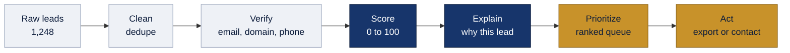
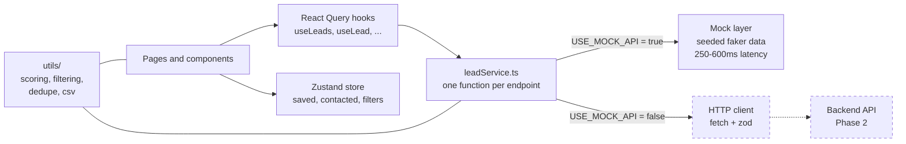
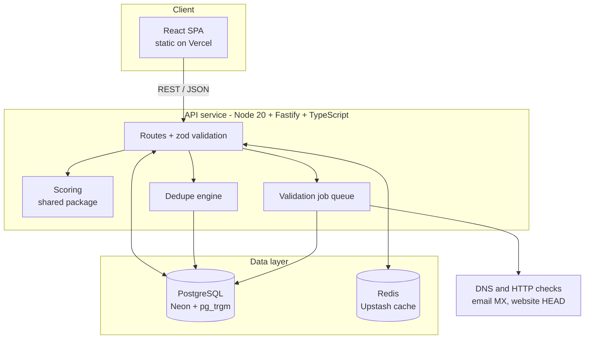
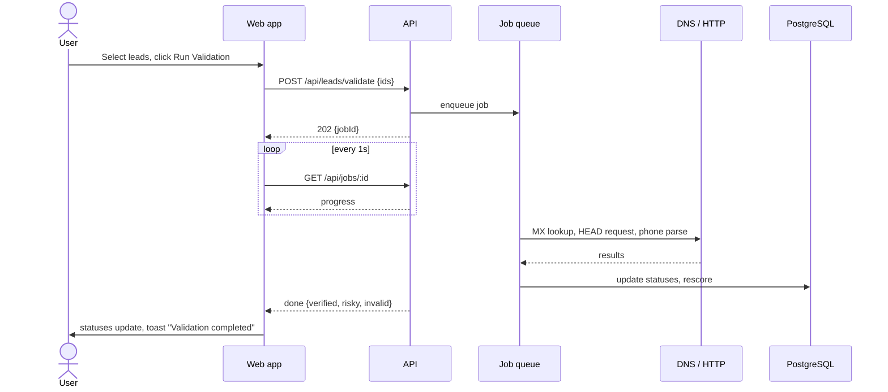
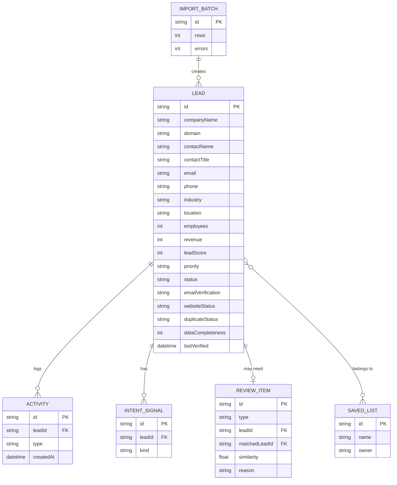
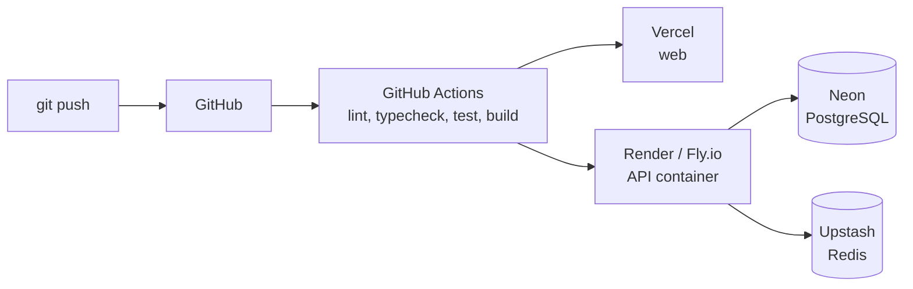

<div align="center">

<picture>
  <source media="(prefers-color-scheme: dark)" srcset="apps/web/src/assets/brand/pinpoint-logo-dark.svg">
  
</picture>

<br/><br/>

### Turn raw leads into sales-ready opportunities.

An intelligence layer on top of lead generation: clean, verify, score and **explain** every lead,
so a sales team knows exactly **who to contact first, and why**.

<br/>


**[Live Demo](#-demo)** &nbsp;•&nbsp; **[Video Walkthrough](#-demo)** &nbsp;•&nbsp; **[Architecture](#-architecture)** &nbsp;•&nbsp; **[Quick Start](#-quick-start)** &nbsp;•&nbsp; **[Roadmap](#-roadmap)**

</div>

---

## Table of Contents

1. [The problem](#-the-problem)
2. [The solution](#-the-solution)
3. [Demo](#-demo)
4. [Features](#-features)
5. [Screens at a glance](#-screens-at-a-glance)
6. [How the lead score works](#-how-the-lead-score-works)
7. [Architecture](#-architecture)
8. [Tech stack](#-tech-stack)
9. [Project structure](#-project-structure)
10. [Data model](#-data-model)
11. [API contract](#-api-contract)
12. [Quick start](#-quick-start)
13. [Design system](#-design-system)
14. [UX principles](#-ux-principles)
15. [Accessibility](#-accessibility)
16. [Performance and caching](#-performance-and-caching)
17. [Deployment](#-deployment)
18. [Testing](#-testing)
19. [Ethics and data practices](#-ethics-and-data-practices)
20. [Trade-offs and limitations](#-trade-offs-and-limitations)
21. [Scaling to 100x](#-scaling-to-100x)
22. [Roadmap](#-roadmap)
23. [About this project](#-about-this-project)

---

## 🎯 The problem

Lead-generation tools such as SaaSquatch are very good at **finding** leads. They hand a salesperson 1,000 rows in seconds. But that creates a new problem:

| What the rep gets | What the rep actually needs |
|---|---|
| 1,000 raw rows | The 50 worth calling first |
| Duplicate companies hiding in the list | One clean record per company |
| Emails that may bounce | Contacts that are verified |
| A table of facts | A reason to act, and a next step |
| A score (if any) with no explanation | A score they can trust and defend |

> **Finding leads is solved. Deciding which leads deserve attention is not.**

## 💡 The solution

Pinpoint sits **after** discovery and **before** outreach. It takes a raw list and runs it through a transparent pipeline.



**The product bet:** a lead score is only useful if the salesperson can see *why* it is high. Every score in Pinpoint is broken down, and every high-priority lead comes with a plain-language reason and a recommended next step.

### How it maps to real sales work

```mermaid
flowchart TB
    subgraph SDR["SDR / BD rep"]
        direction LR
        s1["Open Leads"] --> s2["Sort by score"] --> s3["Read the reason"] --> s4["Contact"]
    end
    subgraph MGR["Sales manager / founder"]
        direction LR
        m1["Open Dashboard"] --> m2["Check pipeline health"] --> m3["Drill into a stage"]
    end
    subgraph OPS["Data / ops analyst"]
        direction LR
        o1["Open Review Queue"] --> o2["Compare duplicates"] --> o3["Merge or keep"] --> o4["Run validation"]
    end
```



---

## 🎬 Demo

| | Link |
|---|---|
| Live app | `ADD LINK AFTER DEPLOY` |
| Video walkthrough (2 min) | `ADD LINK` |
| Source code | `ADD GITHUB LINK` |

### Suggested demo path (about 2 minutes)

| Step | Where | What to show |
|---|---|---|
| 1 | Dashboard | 1,260 demo leads (1,248 generated plus 12 hero records). "Not every lead deserves equal attention." |
| 2 | Leads | Filter to high-quality leads, point at the score ring |
| 3 | Lead Details | Open **Acme Technologies (92)**, explain the score breakdown |
| 4 | Lead Details | Show verification, data quality and the recommended next step |
| 5 | Review Queue | Compare **Acme Inc.** vs **Acme Technologies** (91% similar) and merge |
| 6 | Leads | Select leads and export a real CSV |
| 7 | Dashboard | Counts have updated. The pipeline is cleaner |

---

## ✨ Features

### Core (the product)

| Feature | What it does | Why it matters to a business |
|---|---|---|
| **Explainable lead scoring** | 0 to 100 score from 7 weighted factors | Reps trust and act on scores they can inspect |
| **"Why this lead" insight** | 3 to 5 plain-language reasons per lead plus a next step | Turns data into a decision |
| **Duplicate review** | Fuzzy match with side-by-side compare and merge | Stops two reps contacting the same company |
| **Lead validation** | Simulated email and website checks with staged progress | Demonstrates review before outreach; no email is sent |
| **Priority queue** | Default sort by score, high priority surfaced first | Effort goes to the best opportunities |
| **Data quality rating** | Completeness percentage and missing contact/company details | Makes weak records visible before outreach |

### Workflow

| Feature | Details |
|---|---|
| **Filtering** | Industry, location, minimum score, verification, priority and status. State lives in the URL so views are shareable |
| **Search** | Debounced, live result count, also available from the command palette |
| **Bulk actions** | Select rows or all 1,260 matching demo leads, then validate (up to 100), save, export or mark contacted |
| **Export** | Real client-side CSV download with scope (all, filtered, selected) and field picker |
| **Import** | Upload CSV, preview row-level checks, then import valid records |
| **Saved lists** | Create, edit, delete and export persistent lead lists |
| **Command palette** | `Ctrl/Cmd + K` to search leads, jump to pages, run actions |
| **Activity timeline** | Every action is logged on the lead |

---

## 🖼 Screens at a glance

> Screenshots go in `docs/screenshots/`. Replace the placeholders below after the build.

| Dashboard | Leads |
|:---:|:---:|
|  |  |
| **Lead Details** | **Review Queue** |
|  |  |

### Layout wireframes

**Leads page**

```
┌──────────────┬──────────────────────────────────────────────────────────────────┐
│  PINPOINT    │  Leads  >  All leads            [ Search... ⌘K ]   🔔  ?  (AV)  │
│              ├──────────────────────────────────────────────────────────────────┤
│  Overview    │  Leads                                                           │
│  Leads  ◄──  │  Review, qualify and prioritize your pipeline.                   │
│  Review (128)│                                                                  │
│  Saved Lists │  [ Search ]  Filters  Sort  Columns          Import   Export     │
│  Analytics   │  Industry: SaaS ✕   Score: 80+ ✕   Verified ✕        Clear all  │
│              │  ─────────────────────────────────────────────────────────────── │
│  ──────────  │  All 1,260 │ High Priority 186 │ Needs Review 128 │ Saved        │
│  Settings    │  ┌─┬────────────────┬─────────────┬────────┬───────┬──────────┐  │
│  Help        │  │☐│ Company        │ Contact     │ Score  │Quality│ Priority │ │
│              │  ├─┼────────────────┼─────────────┼────────┼───────┼──────────┤  │
│              │  │☐│ Acme Tech      │ Sarah Chen  │ (92)   │ ✔ Exc.│ ▲ High   │ │
│  (AV) Aniket │  │☐│ Northwind Labs │ Raj Patel   │ (87)   │ ✔ Good│ ▲ High   │ │
│  Admin       │  │☐│ Bluepeak Ltd   │ Mia Torres  │ (64)   │ ! Fair│ ● Medium │  │
│              │  └─┴────────────────┴─────────────┴────────┴───────┴──────────┘  │
│              │  Showing 1-25 of 1,260                          ‹ 1 2 3 ... 51 › │
└──────────────┴──────────────────────────────────────────────────────────────────┘
```

**Lead Details**

```
┌────────────────────────────────────────────────────────────────────────────────┐
│ ‹ Back   [AT] Acme Technologies  acme.io ↗  SaaS · Austin, TX        (92 / 100) │
│                                                          ▲ High   [Save][Export]│
│                                                                  [Mark Contacted]│
├───────────────────────────────────────────────────────┬────────────────────────┤
│ ✦ INSIGHT  Why this lead is high priority             │ Contact                │
│   ✔ Strong industry fit                               │  Sarah Chen, VP Ops    │
│   ✔ Revenue matches target profile                    │  ✔ Email verified      │
│   ✔ Company is actively hiring                        │  ✔ Phone verified      │
│   ✔ Decision-maker identified                         │  ● LinkedIn available  │
│   Recommended next step: reach out to the VP of       ├────────────────────────┤
│   Operations about workflow automation.  [Copy angle] │ Data quality           │
├───────────────────────────────────────────────────────┤  Website   ✔ Valid     │
│ Score breakdown                                       │  Duplicate   No        │
│  Company Fit     ████████████████████░  24 / 25       │  Completeness  94%     │
│  Revenue Fit     ██████████████████░░░  18 / 20       ├────────────────────────┤
│  Company Size    ██████████████████░░░  14 / 15       │ Activity               │
│  Industry Fit    █████████████████████  15 / 15       │  ● Saved · 10m ago     │
│  Contact Quality ██████████████████░░░   9 / 10       │  ● Scored · 55m ago    │
│  Technology Fit  ██████████████░░░░░░░   7 / 10       │  ● Verified · 1h ago   │
│  Intent Signal   █████████████████████   5 / 5        │  ● Imported · 2h ago   │
└───────────────────────────────────────────────────────┴────────────────────────┘
```

---

## 🧮 How the lead score works

One pure function, `scoring.ts`, powers the table, the detail page, the dashboard and the filters. It is unit tested and is written so it can later move into a shared package and run unchanged on the server.

### Factors and weights

| Factor | Weight | What is judged |
|---|:---:|---|
| Company Fit | 25 | Match against the ideal customer profile |
| Revenue Fit | 20 | Revenue inside the target band |
| Company Size | 15 | Employee count inside the target band |
| Industry Fit | 15 | Industry priority |
| Contact Quality | 10 | Decision-maker title and verified channels |
| Technology Fit | 10 | Technology stack overlap |
| Intent Signal | 5 | Hiring, funding or tool-adoption signals |
| **Total** | **100** | |

### Worked example: Acme Technologies

```
Company Fit      24 / 25
Revenue Fit      18 / 20
Company Size     14 / 15
Industry Fit     15 / 15
Contact Quality   9 / 10
Technology Fit    7 / 10
Intent Signal     5 /  5
────────────────────────
Lead Score       92 / 100   ->  High priority
```

### Priority bands

| Score | Priority | Visual |
|:---:|---|---|
| 80 to 100 | **High** | Green ring |
| 60 to 79 | **Medium** | Amber ring |
| 0 to 59 | **Low** | Slate ring |

### The "why" is generated, not invented

Reasons shown in **Why this lead** come from the data itself. Any factor that scores at least 80% of its maximum becomes a reason. Verification and decision-maker facts are added. Nothing is claimed that the record does not support.

### Duplicate similarity

A candidate pair is scored with a weighted blend, and anything at or above **0.85** goes to the Review Queue.

| Signal | Weight |
|---|:---:|
| Domain match | 0.50 |
| Company name similarity | 0.30 |
| Location match | 0.10 |
| Contact email domain | 0.10 |

Names are normalized first: lowercase, legal suffixes removed (`Inc`, `LLC`, `Ltd`), `www` and protocol stripped, punctuation trimmed.

---

## 🏗 Architecture

The project is built in two phases. **Phase 1** is a complete frontend running on a Promise-based mock service. **Phase 2** adds a real backend that satisfies the *same* API contract, so switching over needs no UI changes.

| Phase | Scope | Status |
|---|---|---|
| **1** | Frontend prototype, mock data, API contract, scoring, dedupe logic | Frontend build |
| **2** | Fastify API, PostgreSQL, Redis cache, validation jobs, deployment | Planned |

### Phase 1: how the frontend is wired



Key rules that keep the swap painless:

- Pages talk to data **only** through React Query hooks.
- Every service function maps to exactly one endpoint and validates its response with **zod**.
- Pagination, sorting and filtering run in the service layer exactly as the real API will. The UI never filters a full array itself.
- Business logic lives in `utils/` with no UI imports.

### Phase 2: target backend architecture (planned, not built)



### Validation flow (planned)



In Phase 1 the same flow is **simulated** locally with staged progress and deterministic outcomes.

---

## 🧰 Tech stack

### Frontend (Phase 1)

| Concern | Choice | Why |
|---|---|---|
| Framework | React 19 + Vite + TypeScript (strict) | Fast dev loop, type safety, easy review |
| Styling | Tailwind CSS v4 + shadcn/ui | Consistent tokens, accessible primitives |
| Routing | React Router | URL-driven filter state, deep links |
| Server state | TanStack Query | Loading, error and retry states for free |
| Client state | Zustand (+ persist) | Tiny, no boilerplate, survives refresh |
| Tables | Semantic HTML tables | Accessible sorting, selection, pagination, column visibility |
| Validation | Zod | One schema = runtime check + TypeScript type |
| Charts | Recharts | Simple, declarative |
| Icons | lucide-react | Consistent stroke weight |
| Toasts | sonner | Subtle, accessible |
| Fonts | Inter Variable, JetBrains Mono | Readable numbers, monospace for domains and emails |
| Mock data | @faker-js/faker (fixed seed) | Reproducible 1,260-record demo (1,248 generated + 12 hero leads) |
| CSV | PapaParse | Robust parse and unparse |
| Tests | Vitest | Fast, Vite-native |

### Backend (Phase 2, planned)

| Concern | Choice | Why |
|---|---|---|
| Runtime | Node.js 20 + Fastify | Fast, schema-first, great TypeScript support |
| Database | **PostgreSQL** (Neon serverless) via Prisma | Relational data, `pg_trgm` fuzzy matching, strong indexing |
| Cache | **Redis** (Upstash) | Read-heavy list and dashboard queries |
| Jobs | In-process queue (`p-queue`), BullMQ as the scale-up path | Right-sized for the scope |
| Validation | `node:dns`, HEAD requests, `libphonenumber-js` | No paid APIs required |
| API docs | OpenAPI via `@fastify/swagger` | Self-documenting contract |
| Monorepo | npm workspaces | Shared scoring and schemas |

### Infrastructure (Phase 2, planned)

| Layer | Provider | Type |
|---|---|---|
| Frontend | Vercel | Static hosting + CDN |
| API | Render or Fly.io | Container (long-running jobs, connection pooling) |
| Database | Neon | Serverless PostgreSQL |
| Cache | Upstash | Serverless Redis |
| CI/CD | GitHub Actions | Lint, typecheck, test, build, deploy |

> **Why not pure serverless for the API?** Validation runs make many outbound network calls and can last longer than typical function limits. A small container keeps pooled database connections and finishes long jobs reliably.

---

## 📁 Project structure

```
pinpoint/
├── package.json                  # npm workspaces
├── README.md
├── docs/
│   └── screenshots/              # README images
├── packages/
│   └── shared/                   # Phase 2: zod schemas, scoring, dedupe shared with the API
└── apps/
    ├── web/                      # React frontend
    │   ├── public/
    │   │   └── favicon.svg
    │   └── src/
    │       ├── assets/brand/     # logos
    │       ├── components/
    │       │   ├── ui/           # shadcn primitives
    │       │   ├── layout/       # AppShell, Sidebar, TopBar, CommandPalette
    │       │   ├── dashboard/    # MetricCard, QualityChart, PriorityPipeline, TopLeads
    │       │   ├── leads/        # LeadTable, LeadFilters, LeadScore, ScoreBreakdown, ...
    │       │   ├── review/       # ReviewQueue, DuplicateComparison, ValidationProgress
    │       │   └── common/       # Logo, Modal, EmptyState, ErrorState, Skeletons
    │       ├── pages/            # Dashboard, Leads, LeadDetails, Review, Lists, ...
    │       ├── routes/           # route config
    │       ├── hooks/            # React Query hooks
    │       ├── stores/           # Zustand stores
    │       ├── services/         # leadService (mock now, HTTP later)
    │       ├── data/             # seeded generator + hero leads
    │       ├── types/            # domain types + api.ts zod schemas
    │       ├── utils/            # scoring, filtering, dedupe, csv (no UI imports)
    │       ├── lib/              # helpers (cn, formatters, mock clock)
    │       └── config.ts         # USE_MOCK_API flag
    └── api/                      # Phase 2: Fastify backend
```

---

## 🗄 Data model



### Mock dataset rules

- **1,248 fictional leads** from a seeded generator, plus **12 hand-built "hero" leads** with stable IDs.
- Everything is fictional. Phone numbers use the `555-01xx` range and domains are made up.
- Quotas make the dashboard numbers **computed, not typed in**: 186 high priority, 934 verified emails, 128 review items.
- The 128 review items split into 41 Needs Verification, 33 Potential Duplicate, 28 Low Data Quality and 26 High Potential / Missing Info.
- Hero leads cover the demo story: Acme Technologies (92), the Acme Inc. duplicate pair (91%), a risky email, an invalid email, a high-score lead missing a phone, and a low-score lead.

---

## 🔌 API contract

`src/types/api.ts` holds a zod schema for every request and response. The mock service implements these endpoints; the Phase 2 backend implements the same ones.

| Method | Endpoint | Purpose |
|---|---|---|
| `GET` | `/api/leads` | List with search, filters, sort, pagination |
| `GET` | `/api/leads/:id` | Lead detail with activity |
| `PATCH` | `/api/leads/:id` | Save or change status |
| `POST` | `/api/leads/validate` | Run validation on selected leads |
| `POST` | `/api/leads/import` | Import rows |
| `GET` | `/api/leads/export` | CSV or Excel export |
| `GET` | `/api/review-queue` | Review items and counts |
| `POST` | `/api/review/merge` | Merge two records |
| `POST` | `/api/review/dismiss` | Dismiss a review item |
| `GET` | `/api/dashboard/stats` | KPIs and charts for 7d, 30d, 90d |
| `GET/POST/PATCH/DELETE` | `/api/lists` | Saved lists |

**Example: list request**

```http
GET /api/leads?industry=SaaS&minScore=80&verification=verified&sort=leadScore&order=desc&page=1&pageSize=25
```

```json
{
  "items": [ { "id": "ld_001", "companyName": "Acme Technologies", "leadScore": 92 } ],
  "total": 64,
  "page": 1,
  "pageSize": 25
}
```

**Consistent error shape**

```json
{ "error": { "code": "VALIDATION_ERROR", "message": "pageSize must be 25, 50 or 100" } }
```

---

## 🚀 Quick start

### Prerequisites

| Tool | Version |
|---|---|
| Node.js | 20 or newer |
| npm | 10 or newer |
| Git | any recent version |

### Run it

```bash
# 1. Clone
git clone <YOUR_REPO_URL>
cd pinpoint

# 2. Install (installs all workspaces)
npm install

# 3. Start the dev server
npm run dev
```

Open **http://localhost:5173**. No API keys, database or environment setup needed. The app runs entirely on mock data.

### Scripts

| Command | What it does |
|---|---|
| `npm run dev` | Start the web app with hot reload |
| `npm run build` | Typecheck and build for production |
| `npm run test` | Run unit tests |
| `npm run lint` | Lint the web app |

### Environment variables

| Variable | Default | Purpose |
|---|---|---|
| `VITE_USE_MOCK_API` | `true` | `true` uses the mock service. `false` calls the real API |
| `VITE_API_URL` | `http://localhost:3001` | Backend base URL (Phase 2) |

### Try the error and empty states

| URL | Shows |
|---|---|
| `/leads?error=1` | Error state with "Try again" |
| `/leads?industry=Nonexistent` | Empty state with "Clear filters" |

---

## 🎨 Design system

Pinpoint's look follows its logo: **deep navy and gold**, calm and trustworthy. Color is used to communicate state, not to decorate.

### Palette

| Role | Hex | Use |
|---|---|---|
| Navy | `#0B1B3A` | Primary text, sidebar, emblem |
| Navy light | `#17356B` | Hover, gradients |
| Gold | `#C8922A` | Accent, key actions, brand moments |
| Gold light | `#F7CF6A` | Gradient highlight |
| Background | `#F7F8FA` | App background |
| Surface | `#FFFFFF` | Cards and tables |
| Border | `#E5E7EB` | Thin dividers |
| Success | `#16A34A` | Verified, high score |
| Warning | `#D97706` | Risky, medium score |
| Danger | `#DC2626` | Invalid, errors |

### Typography

| Style | Spec |
|---|---|
| Typeface | Inter Variable, with tabular numbers on every figure |
| Monospace | JetBrains Mono, only for domains, emails and IDs |
| Page title | 24 / 32, semibold |
| Section heading | 16 / 24, semibold |
| KPI number | 28 / 32, semibold |
| Body | 14 / 20 |
| Meta | 13 / 18 |
| Label | 12 / 16, medium |

### Principles

- 4 / 8 px spacing grid, radius 6 / 8 / 12, thin borders, minimal shadows.
- Motion only on hover, focus and dialogs (120 to 160 ms), and it respects `prefers-reduced-motion`.
- No gradients in the UI chrome, no stock images, no emoji icons.
- Company logos are generated monogram tiles, so the app makes **no external image requests**.

---

## 🧠 UX principles

1. Reduce cognitive load. Show the most important information first.
2. Progressive disclosure. Detail appears when asked for.
3. Keep actions next to the data they affect.
4. Make "What should I do next?" obvious.
5. Explain every score. Avoid AI magic without explanation.
6. Prioritize decisions over decoration. If a feature does not help a rep decide faster, it is removed.

---

## ♿ Accessibility

- Semantic HTML: `nav`, `main`, and tables with proper header scope.
- Visible focus rings and full keyboard support. `Esc` closes dialogs, arrow keys work in the command palette.
- Icon-only buttons have `aria-label` and tooltips.
- Toasts and validation progress use `aria-live`.
- Status is **never color alone**: every status has an icon and a text label.
- WCAG AA contrast, a skip-to-content link, focus trapped in dialogs and restored on close.

---

## ⚡ Performance and caching

### Phase 1 (frontend)

| Technique | Where |
|---|---|
| Server-style pagination, sorting and filtering | Service layer, not the component |
| Debounced search (200 ms) | Search inputs |
| Query caching and request de-duplication | TanStack Query |
| Lazy-loaded Excel library | Only when Excel export is chosen |
| Skeletons instead of spinners | Table rows, cards, charts |

### Phase 2 (backend, planned)

| Technique | Detail |
|---|---|
| Versioned Redis keys | `leads:list:{hash}` TTL 60s, `dashboard:stats:{range}` TTL 120s, `lead:{id}` TTL 300s, `dns:mx:{domain}` TTL 24h |
| Cache invalidation | A `leads:version` counter is bumped on every write, so cached keys never go stale after a merge, import or validation |
| HTTP caching | ETag and Cache-Control on list and detail |
| Compression | gzip / brotli |
| Database | Indexes on score, priority, industry, normalized domain, created date, plus GIN trigram index on names |
| Query hygiene | Select only needed columns, no N+1 |
| Protection | Rate limiting, Helmet, restricted CORS |

#### Benchmark

| Endpoint | Cold p95 | Cached p95 |
|---|---|---|
| `GET /api/leads` | `TBD` | `TBD` |
| `GET /api/dashboard/stats` | `TBD` | `TBD` |

> Fill this table in from the `autocannon` script once the backend is built.

---

## 🌐 Deployment

> **Planned for Phase 2.** The frontend alone can already be deployed as a static site.



### Deploy the frontend now (static)

1. Push the repo to GitHub.
2. Import it in **Vercel**. Set **Root Directory** to `apps/web`, build command `npm run build`, output directory `dist`.
3. Add `VITE_USE_MOCK_API=true`.
4. Deploy.

### Deploy the backend later

1. Create a Neon database and an Upstash Redis instance.
2. Deploy `apps/api` as a container on Render or Fly.io with `DATABASE_URL`, `REDIS_URL`, `WEB_ORIGIN`.
3. Run `prisma migrate deploy` on release.
4. In Vercel set `VITE_USE_MOCK_API=false` and `VITE_API_URL` to the API URL.

### Equivalent on the big clouds

| This project | AWS | GCP | Azure |
|---|---|---|---|
| Vercel | S3 + CloudFront | Cloud Storage + CDN | Static Web Apps |
| Render / Fly.io | ECS Fargate | Cloud Run | Container Apps |
| Neon | RDS PostgreSQL | Cloud SQL | Azure Database for PostgreSQL |
| Upstash | ElastiCache | Memorystore | Azure Cache for Redis |

---

## 🧪 Testing

| Layer | What is tested |
|---|---|
| Unit (Vitest) | Scoring function, filter logic, dedupe similarity, CSV export |
| Phase 2 | Endpoint tests for list, detail and validate. SSRF guard test for the website checker |

```bash
npm run test
```

Manual acceptance checklist:

- [ ] `npm run build` passes with zero TypeScript errors
- [ ] No console errors
- [ ] No dead buttons (unbuilt actions are disabled with a "Coming soon" tooltip)
- [ ] Numbers match everywhere: dashboard, sidebar badge, table counts, export count
- [ ] Full demo flow works end to end
- [ ] Table becomes cards on mobile width

---

## 🛡 Ethics and data practices

- Pinpoint processes **publicly available business data and data the user imports**. It does not scrape.
- The demo uses **entirely fictional** companies and people.
- A future crawler would respect `robots.txt` and site terms.
- Planned: delete and opt-out endpoints so a person can be removed on request.
- No sensitive personal data. GDPR and CCPA considerations (lawful basis, minimization, deletion rights) are part of the Phase 2 design.
- Validation checks are polite: concurrency limits, per-host throttling, and an SSRF guard that blocks private and loopback addresses.

---

## ⚖️ Trade-offs and limitations

| Decision | Reason | Cost |
|---|---|---|
| Frontend first with mock data | Fast, verifiable UX before investing in backend | Numbers are simulated until Phase 2 |
| Rule-based scoring, not ML | Transparent and explainable. No training data needed | Cannot learn from win/loss outcomes yet |
| In-process job queue | Right-sized for the scope | Not horizontally scalable (BullMQ is the next step) |
| No real scraping | Keeps the focus on lead *quality*, avoids legal risk | Lead *discovery* stays with the source tool |
| No authentication | Out of scope for the challenge | Single-user demo only |
| Free-tier infrastructure | Zero cost to run | Cold starts on free container hosts |

---

## 📈 Scaling to 100x

| Pressure point | Today | At 100x |
|---|---|---|
| Validation throughput | In-process queue | BullMQ workers on separate instances |
| Read load | Redis cache | Read replicas + longer-lived cache tiers |
| Search | `pg_trgm` + indexes | Dedicated search index (OpenSearch / Typesense) |
| Dedupe | Candidate match by domain + trigram | Blocking keys + batch pairwise scoring |
| Enrichment | Not included | Pluggable provider adapters behind a queue |
| Multi-tenancy | Single workspace | Row-level tenant isolation, per-tenant ICP weights |
| Observability | Logs | Structured logs, tracing, error reporting |

---

## 🗺 Roadmap

### Phase 1: Frontend demo

- [x] App shell, sidebar, top bar, command palette
- [x] Leads table with search, basic filters, sort, column visibility, selection and pagination
- [ ] Advanced employee-size, revenue, technology and score-range filters with removable filter chips
- [x] Lead score and score breakdown
- [x] Lead Details with "Why this lead" and data quality
- [x] Dashboard
- [x] Review Queue, duplicate compare and merge
- [x] Validation simulation
- [x] CSV export and import preview
- [x] Saved lists with create, edit, delete and export
- [ ] Undo after deleting a saved list
- [x] Editable ideal-customer-profile weights with live re-scoring
- [x] Loading, empty and error states
- [x] Responsive desktop and mobile layouts
- [ ] Complete keyboard and screen-reader accessibility audit

### Phase 2: Backend

- [ ] Monorepo with shared package
- [ ] PostgreSQL schema, migrations and seed
- [ ] Read endpoints with Redis caching
- [ ] Real validation (MX, website, phone)
- [ ] Dedupe engine and merge
- [ ] Import and export
- [ ] Frontend switch-over via `VITE_USE_MOCK_API=false`
- [ ] Benchmarks and deployment

### Later

- [ ] CRM integrations (HubSpot, Salesforce)
- [ ] Outcome-based score tuning from win/loss data
- [ ] Email draft generation for the recommended next step
- [ ] Team workspaces and roles

---

## 👤 About this project

Pinpoint was built as a focused response to a Full Stack Developer challenge: study a lead-generation tool and, within roughly five hours, build one or two features that make it meaningfully more valuable to a business.

The chosen direction is **Quality First**: instead of building another scraper, improve what happens *after* leads are found, which is where sales time is actually won or lost.

**Author:** Aniket Vishwakarma

> This is an independent project. It is not affiliated with, or endorsed by, SaaSquatch or Caprae Capital. All data in the demo is fictional.

<div align="center">

<br/>


**Pinpoint** · Know who to call first.

</div>
